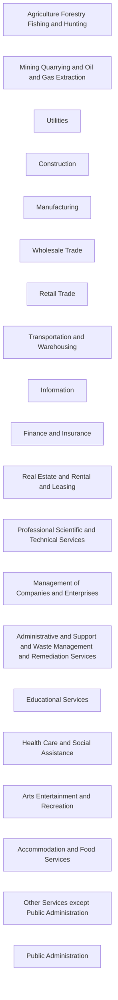

# Public dbt Projects

## About

The goal of this repo is to start organizing great example (fictional but relevant) projects from different industries to help current and aspiring data analysts, engineers, and scientists to use example projects in their relative industry to improve modeling of data.
* Data Modeling will have a different definition based on job title
  * Statistical and/or Machine Learning Model development
  * Taking raw application sources and shaping data in a way that the business can understand and gain self-service insights from

## How to use

Click the ector you are particularly interested in. If you see a sample project use it. If you don't please consider having it added.

## Projects by Sector/Industry
This is a collection of dbt projects categorized by Sectors and Industry:

| Definition | Sector   |  Project |
| ----------------------------------------------------------- | -------- | -------- |
| Agriculture, Forestry, Fishing and Hunting  | 11	   | Not Available |
| Mining, Quarrying, and Oil and Gas Extraction | 21	   | Not Available |
| Utilities  | 22	   | Not Available |
| Construction  | 23	   | Not Available |
| Manufacturing  | 31-33	   | Not Available |
| [Wholesale Trade](#wholesale-trade)  | 42 | Not Available |
| [Retail Trade](#retail-trade) | 44-45	   | Not Available |
| Transportation and Warehousing  | 48-49	   | Not Available |
| Information  | 51	   | Not Available |
| Finance and Insurance  | 52	   | Not Available |
| Real Estate and Rental and Leasing  | 53	   | Not Available |
| Professional, Scientific, and Technical Services | 54	   | Not Available |
| Management of Companies and Enterprises  | 55	   | Not Available |
| Administrative and Support and Waste Management and Remediation Services  | 56	   | Not Available |
| Educational Services  | 61	   | Not Available |
| Health Care and Social Assistance  | 62	   | Not Available |
| Arts, Entertainment, and Recreation  | 71	   | Not Available |
| Accommodation and Food Services  | 72	   | Not Available |
| Other Services (except Public Administration)  | 81	   | Not Available |
| Public Administration  | 92	   | Not Available |
 
For more information on these sector visit [BLS](https://www.bls.gov/ces/naics/) and [census.gov](https://www.census.gov/naics/?58967?yearbck=2022):

---

### Agriculture Forestry Fishing and Hunting  
### Mining Quarrying and Oil and Gas Extraction  
### Utilities  
### Construction  
### Manufacturing

### Wholesale Trade

| Name | Project Link | Info Link | Maintainer|
|--|---|--|--|
| Wide World Importers | | fictional wholesale novelty goods import and distributor operating from San Fran bay area. Customers are companies selling to individuals| Microsoft |

### Retail Trade 

| Name | Project Link | Info Link | Maintainer|
|--|---|--|--|
| Jaffle Shop | [Jaffle Shop Repo](https://github.com/dbt-labs/jaffle_shop) | ecommerce store | dbt Labs

### Transportation and Warehousing
### Information  
### Finance and Insurance  
### Real Estate and Rental and Leasing  
### Professional Scientific and Technical Services 
### Management of Companies and Enterprises  
### Administrative and Support and Waste Management and Remediation Services  
### Educational Services  
### Health Care and Social Assistance  
### Arts Entertainment and Recreation  
### Accommodation and Food Services  
### Other Services (except Public Administration)  
### Public Administration  

# Extra

## Sector Mapping
